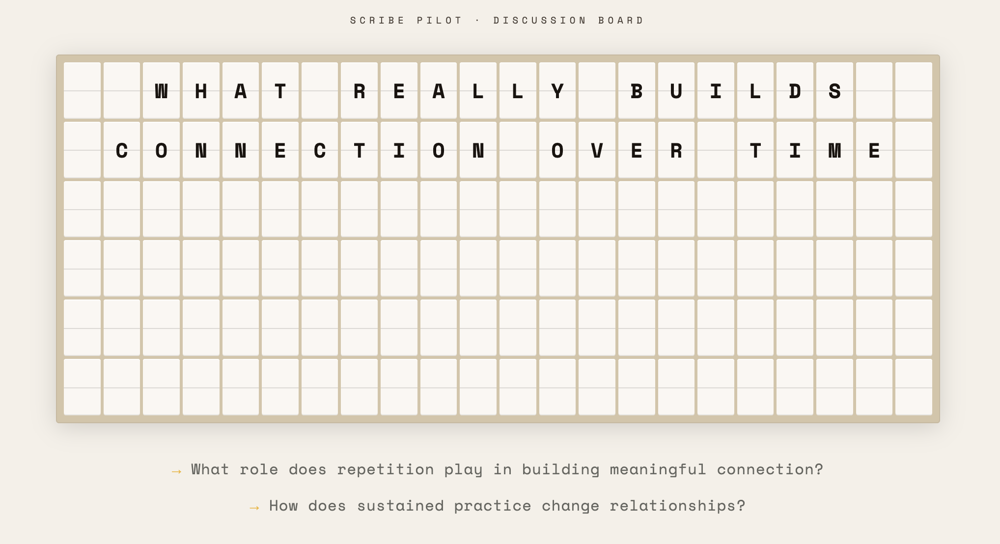

# Scribe Pilot

**Live workshop facilitation, powered by the room's own conversation.**

Several discussion tables run in parallel. Each table has a laptop that listens, and an AI scribe turns the talk into a visual board the table can actually read from across the room. Meanwhile a theme engine watches *all* the tables at once, looking for the thing several groups are circling without knowing it. When it finds one, the facilitator can flip it up on a split-flap board at the front of the room — and that becomes everyone's next topic.

The room writes its own agenda, live.



> **About to facilitate rather than read the code?** Go straight to **[GUIDES/RUNNING_A_WORKSHOP.md](GUIDES/RUNNING_A_WORKSHOP.md)** — one page, no code, everything you need to run a session.

---

## The loop

```
mic → Deepgram ASR → transcript
                        ↓
              scribe loop (every 45s, per table)
                        ↓
        board: clusters · ideas · quotes · flags · synthesis
                        ↓
              theme engine (every 180s, across tables)
                        ↓
              facilitator console: reveal / edit / dismiss
                        ↓
              split-flap board → the room's next topic
```

Three loops run continuously:

| Loop | Interval | What it does |
|------|----------|--------------|
| Scribe | 45s | Per table with new speech. Sends the new transcript plus current board state to Claude; gets back a summary and a list of board ops. |
| Metrics | 60s | Words-per-minute, novelty (share of content words unseen in the last 10 min), and a status machine: `quiet` · `circling` · `flowing` · `converging`. |
| Theme | 180s | Digests every table and looks for themes with genuine support from 2+ tables. Empty is the normal, expected result. |

The scribe is deliberately restrained. It is told to *diagnose what a conversation means, not describe what was said*, to prefer sharpening an existing cluster over spawning a new one, and to keep at most three quotes on the board — actively swapping out ones that have been superseded. An empty op list is a valid answer.

## Pages

Everything is served under the `/api/` path prefix. `/` redirects to the console.

| URL | Who it's for |
|-----|--------------|
| `/api/console.html` | **The facilitator.** Workshops and sessions, table status, sparklines, one-line AI summaries, theme candidates with evidence, and reveal/dismiss controls. Phone-friendly. Requires sign-in — everything else starts here. |
| `/api/pod.html?table=<id>&key=<joinKey>` | **The table.** Mic capture and the live scribe board. Warm paper/ink, large type, readable from three metres. Participants need no account. |
| `/api/board.html?session=<id>&key=<boardKey>` | **The room.** 6×22 split-flap display. Reveals flip in column by column with synthesised clicks. Light by default, dark theme toggle. |
| `/api/admin.html` | **The owner.** User list, role toggles, and a one-off "claim unowned data" action. |
| `/api/report/<sessionId>` | **Everyone else.** The session write-up, readable with no account. Summary only — never transcripts, boards, or theme evidence. |

**Do not hand-write pod or board URLs.** Both carry a capability key minted when the group or session was created, and both sockets refuse a connection without it. Copy the pod link from the group's **Copy link** button and open the board from the session's **▦ Board** button. A bare `pod.html?table=T1` closes immediately with `Unknown table`.

Add `&demo=1` to a copied pod link for demo mode: a scripted transcript every five seconds, no microphone needed. The group still has to exist.

## Stack

- Node.js 24, TypeScript 5.9, ES modules, pnpm workspace
- Express 5 + `ws` for WebSockets
- Postgres via raw `pg` — schema created on boot, state hydrated before the server accepts connections
- Clerk for facilitator sign-in (Google), proxied through the app
- Deepgram `nova-3` live ASR (raw linear16 PCM in, transcript out)
- Anthropic Claude for the scribe loop, theme engine, session summaries, and transcript search
- Plain HTML/CSS/JS pages — no React, no build step for the front end

## Repository layout

The only deployable is `artifacts/api-server`. The rest is workspace scaffolding.

```
artifacts/
  api-server/          ← the app
    src/
      index.ts          — HTTP + WS entry; ensureSchema → hydrateFromDb → listen
      app.ts            — Express: Clerk proxy, static files, /api routes
      state.ts          — in-memory store, snapshot builders, broadcast helpers
      persist.ts        — Postgres read/write, per-entity write queue
      ws-handler.ts     — WebSocket role routing (pod / console / board)
      deepgram.ts       — per-table live ASR bridge
      anthropic.ts      — Claude client (SDK, retries, schema-enforced JSON)
      ws-auth.ts        — single-use console tickets, capability key compare
      users.ts          — resolve a Clerk user to an AppUser + role
      scribe.ts         — 45s scribe loop + op application
      metrics.ts        — 60s WPM / novelty / status loop
      themes.ts         — 180s per-session theme engine
      summary.ts        — end-of-session Markdown report
      jsonl-log.ts      — append-only event log
      routes/           — workshops, sessions, groups, tables, search, admin, ws, health
      middlewares/      — Clerk auth guards, Clerk CDN proxy
      *.test.ts         — persist, migrations, snapshot isolation, scribe schema
    public/             — pod.html, console.html, board.html, admin.html
  mockup-sandbox/       — Vite/React UI sandbox (not part of the running app)
  facilitator-mobile/   — Expo client (early)
lib/                    — shared workspace packages (db, api-zod, api-spec, api-client-react)
```

## Data model

- **Workshop** — the top-level event ("Robotics Workshop"). Contains sessions.
- **Session** — a time block or phase within a workshop ("Day 1 Morning"). Contains discussion groups.
- **Group / table** — one physical table running one `pod.html`. Holds a transcript, a board, and metrics.

Tables can be archived and unarchived; archived tables still feed search and session summaries. A session can generate a Markdown report with executive summary, cross-table themes, per-table highlights, notable quotes, open questions and next steps.

## WebSocket protocol

Connections carry a `?role=` query param.

| Role | Credential | In | Out |
|------|-----------|-----|-----|
| `pod&table=<id>&key=<joinKey>` | the group's join key | `start_audio` (sample rate), binary linear16 PCM chunks, `correction`, `demo_transcript` | `canvas_state` (full board + summary), `tick` (live transcript line) |
| `console&ticket=<t>` | a single-use ticket from `POST /api/ws-ticket` | `reveal`, `reveal_custom`, `dismiss` | filtered state snapshots |
| `board&session=<id>&key=<boardKey>` | the session's board key | — | `reveal` (text + seed prompts), for that session only |

Each role proves itself differently, and none of them takes the client's word for who it is. The console ticket is minted behind `requireAuth`, so the user ID is server-established rather than asserted in the payload. Pod and board keys are capability checks rather than identity checks — participants are not Clerk users, and the goal is that knowing a table ID does not let you join a room or inject speech into someone else's transcript.

The pod captures audio through an `AudioContext` and streams raw linear16 PCM rather than a webm container — Deepgram decodes it unambiguously, and there is no container header to lose on reconnect. The pod announces its actual sample rate in `start_audio` before the first chunk, and the server opens the Deepgram socket lazily at that point. Deepgram auto-reconnects on close and is kept alive every 5 seconds.

A facilitator can also type a `correction` at the pod ("that was Maria, not Marika") — it is queued on the table and triggers a scribe run immediately rather than waiting for the next 45-second tick.

## Running it

Requires Postgres and a Node 24 toolchain.

```bash
pnpm install
pnpm --filter @workspace/api-server run dev    # build + start
pnpm --filter @workspace/api-server run test   # persistence tests
pnpm run typecheck                             # whole workspace
```

On Replit the **API Server** workflow starts it automatically and assigns `PORT`.

### Environment

| Variable | Required | Purpose |
|----------|----------|---------|
| `PORT` | yes | Server refuses to start without it |
| `DATABASE_URL` | yes | Postgres connection string |
| `ANTHROPIC_API_KEY` | yes | Scribe loop, theme engine, summaries, search |
| `DEEPGRAM_API_KEY` | yes | Live ASR per table |
| `CLERK_PUBLISHABLE_KEY` | yes | Facilitator sign-in |
| `CLERK_SECRET_KEY` | yes | Server-side session verification |
| `LOG_LEVEL` | no | Pino level |
| `NODE_ENV` | no | `development` enables pretty logs |
| `ANTHROPIC_MODEL` | no | Overrides the default model without a redeploy |

### Seeing it work without a microphone

Everything starts in the console — you cannot conjure a table by typing a URL.

1. Open `/api/console.html` and sign in.
2. **⊟ New Session** — the session is the unit the board and the theme engine work on.
3. **＋ New Group**, twice. In each, set the **Session** dropdown to the session you just made. It defaults to *— No session —*, and a group with no session gets no board and never feeds a theme.
4. **Copy link** on each group, append `&demo=1` to the copied URL, and open both. Each pod now feeds a scripted transcript line every five seconds.
5. **▦ Board** on the session to put the display up.

Give it about four minutes: two scribe passes per table at 45s, then the first theme pass at 180s. **The theme engine needs at least two live tables in the same session** — with one table it does not run at all.

## Logging

Every transcript line, scribe op, theme pass, reveal and dismiss is appended to `scribe-pilot.jsonl` in the server's working directory — a full replayable record of a workshop.

## Status

A working pilot. Authentication and tenant isolation are enforced server-side: every mutating route is behind `requireAuth` with an ownership check, the console socket takes a server-minted ticket, and pod and board sockets require their capability keys. `/healthz` and `/api/report/<sessionId>` are the deliberate exceptions — the report link is meant to be shareable with attendees who have no account, and it exposes the generated summary only.

The HTML pages themselves are served publicly, and `console.html`'s sign-in overlay is presentation rather than a security boundary. Anyone can load the console page. Getting data out of it takes a signed-in Clerk session for the REST reads and a server-minted ticket for the live snapshot. That is the stronger guarantee, and it is the one to rely on.

Theme passes and reveals are scoped to a session, so concurrent workshops on one instance no longer bleed into each other.

Three things to know before pointing it at a real event:

- **The scribe and the ASR have never run end to end.** ⏳ Everything else is covered — auth paths, persistence, migrations, snapshot isolation, schema-enforced scribe output — but no one has yet watched a real Deepgram transcript drive a real scribe cycle against this code. The first live session proves that path. *Delete this bullet once a workshop has actually run; the same claim appears in [GUIDES/RUNNING_A_WORKSHOP.md](GUIDES/RUNNING_A_WORKSHOP.md) and goes at the same time.*
- **One facilitator per workshop.** There is no sharing or team concept. A second facilitator signing in gets their own empty console; they cannot see or co-run someone else's session. Participants at tables need no account, which is the shape the product is actually built for.
- **Keys do not rotate.** Anyone holding a pod link can join that table, and anyone holding a board link can watch that session's reveals, until the group or session is deleted.

See `replit.md` for operational notes and gotchas, and **[GUIDES/RUNNING_A_WORKSHOP.md](GUIDES/RUNNING_A_WORKSHOP.md)** if you are about to facilitate rather than to read the code.
